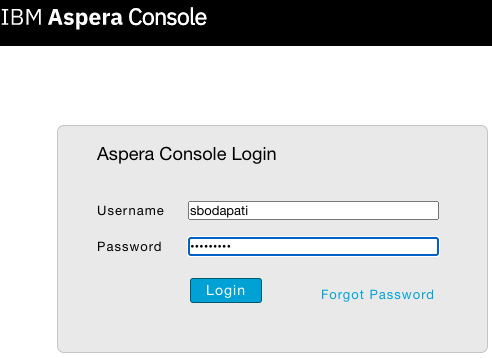
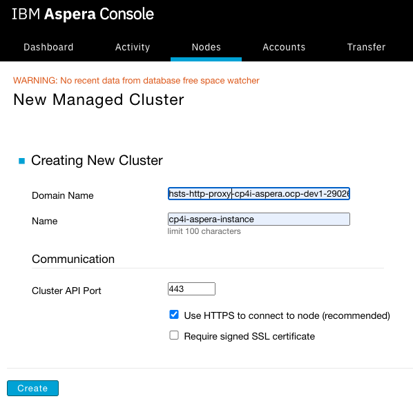
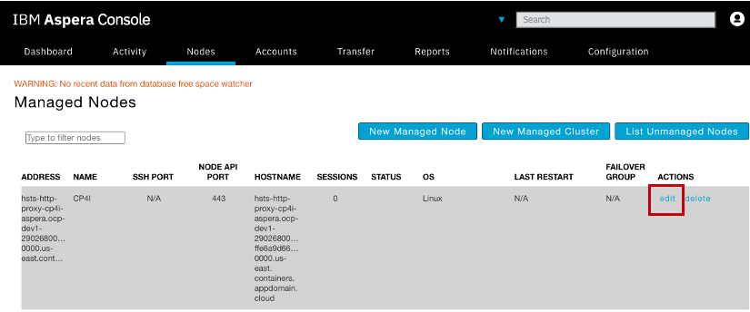
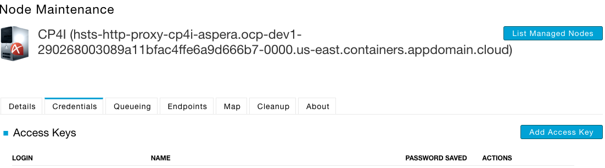
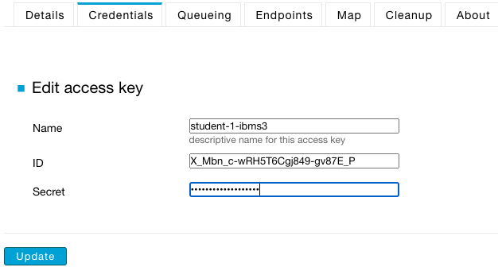
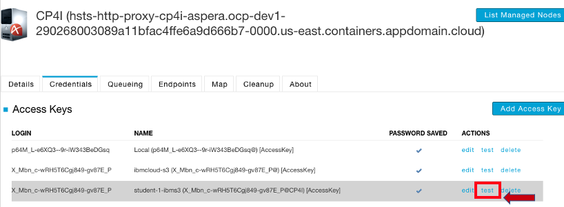

# Aspera Console Dashboard

This lab will guide you how to use Aspera Console to visualize the file transfers you did in lab1.  

 

Logon to the VDI Desktop!  

Open Google Chrome or Firefox browser. 

Copy / paste Aspera Console URL https://localhost/aspera/console  

### Create a New Managed Cluster

You will add, Aspera High Speed Transfer instance deployed in the Cloud Pak for Integration. 

Click on "Nodes" > New Managed Cluster  

Click on "edit" icon  
This will open Node Maintenance page. Here, you will be able to add your IBM Cloud Object Storage Access Key, and Secret.  

Click "Add Access Key"  

Enter the Access Key, and the Secret of IBM Cloud Object Storage registered with Aspera CP4I HSTS instance.  

Test the Credentials!  

Make sure it's tested successfully! Click <OK>  
 

### Aspera desktop client - Transfer some files 

Use the Aspera Desktop Client and transfer some files or directory.  

### Aspera Console - view transfers
Click on the Dashboard, and watch the files being transferred.  
Click on each transfer file to see additional details of the file transfer.  

!!! Congratulations - You have finished Aspera Console lab. You now able to monitor the file transfers and history. !!!   

