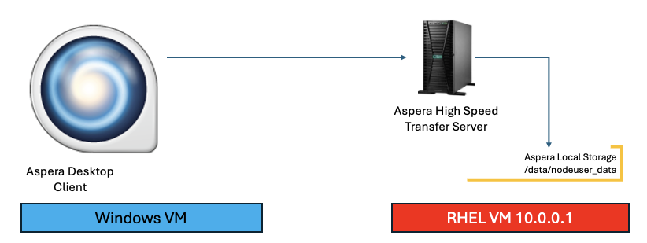
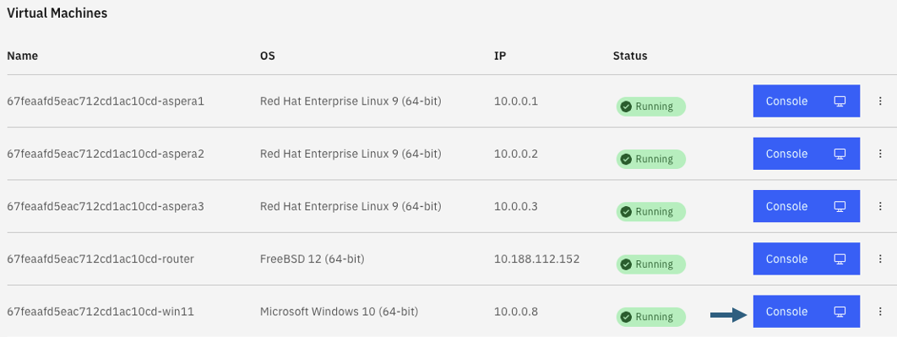
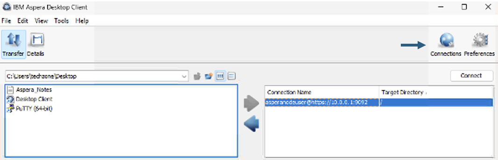
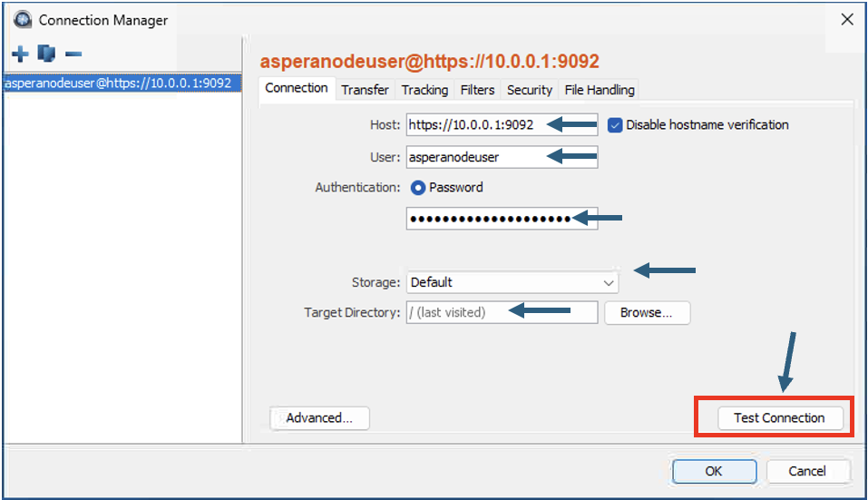
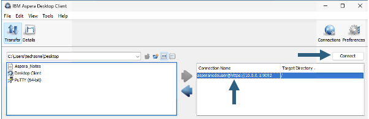
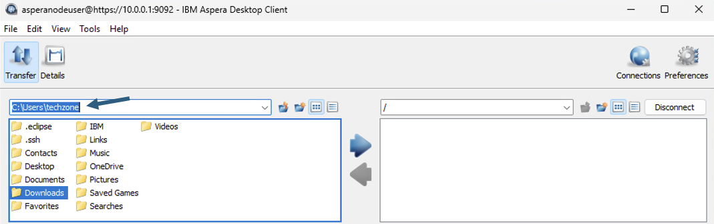
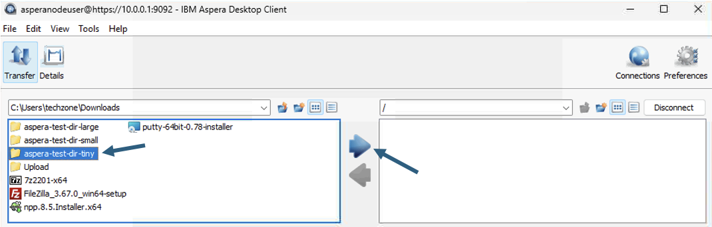
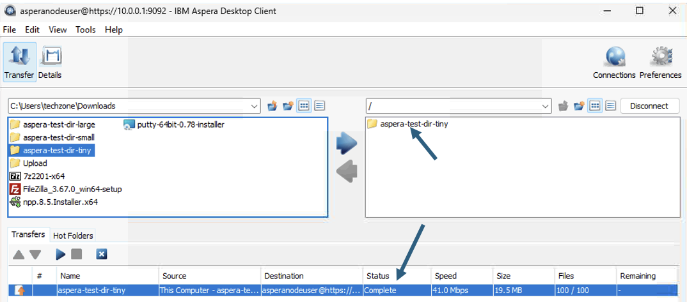
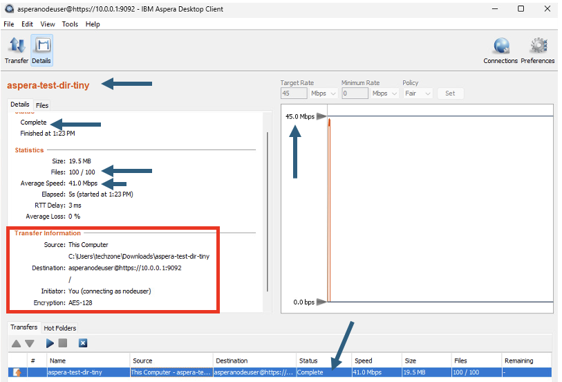
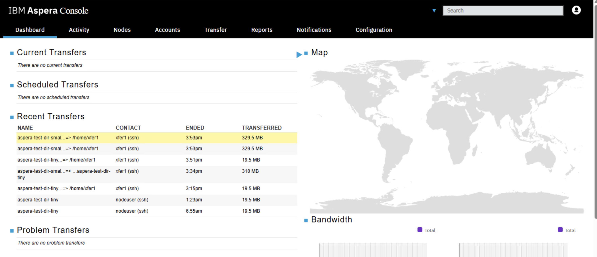

# Aspera Desktop Client - Transfering files to HSTS Local Storage

[Return to Aspera Desktop Client labs page](../index.md)

---

# Table of Contents 
- [1. Overview](#overview)
- [2. Aspera Desktop Client Application](#aspera-desktop-client-install)
- [3. Aspera Console (Optional)](#ascli-console)
- [4. Summary](#summary)

---

## 1. Overview 

This is a very simple lab to transfer files from the Aspera Desktop Client to HSTS local storage. 

## 2. Aspera Desktop Client Application 

From your Techzone Aspera CoE Environment, click on the Windows VM Console. 

Login with techzone id, and the password.  

Double click on \"Aspera Desktop Client" Application from the Windows Desktop.  

The \"Aspera Desktop Client\" is preconfigured to connect to the Aspera High Speed Transfer Server.  

Review the connection details.  

Click on the \<Connections\> button. 

Click \<Test Connection\> button. You should get \"The server was accessed successfully"\>.  

Click the Ok Button. 

Click the \<Connect\> button, that should connect to the HSTS server.  

Navigate to the Downloads folder as shown above, and double click on the Downloads folder. 

Select \"aspera-test-dir-tiny\" and click blue arrow in the middle to transfer the entire directory to the HSTS local storage.  

Notice the transfer status being changed during the transfer. See final status changed to \"Complete\".  

## 3. Aspera Console (Optional) 
You can also check the Transfer Activity from Aspera Console User Interface.  

Open "IBM Aspera Console" from the Google Chrome Bookmark bar. Login with the credentials provided. You should see the transfer activity being recorded as below. Explore the activity. 

## 4. Summary 
You have explored IBM Aspera Desktop Client to transfer files from local computer to Aspera High Speed Transfer's Local Storage.  

#### !!! Congratulations !!!

