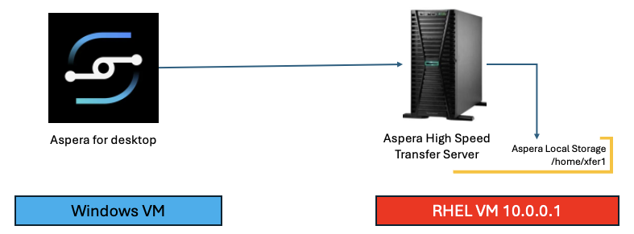
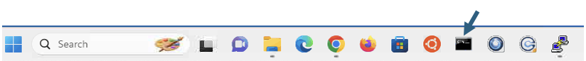
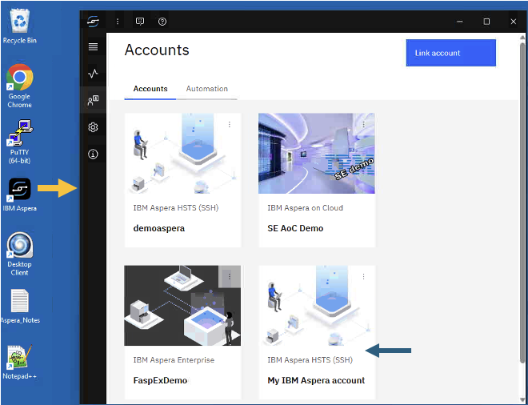
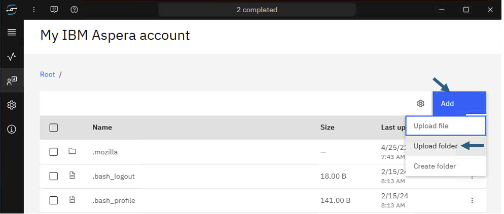
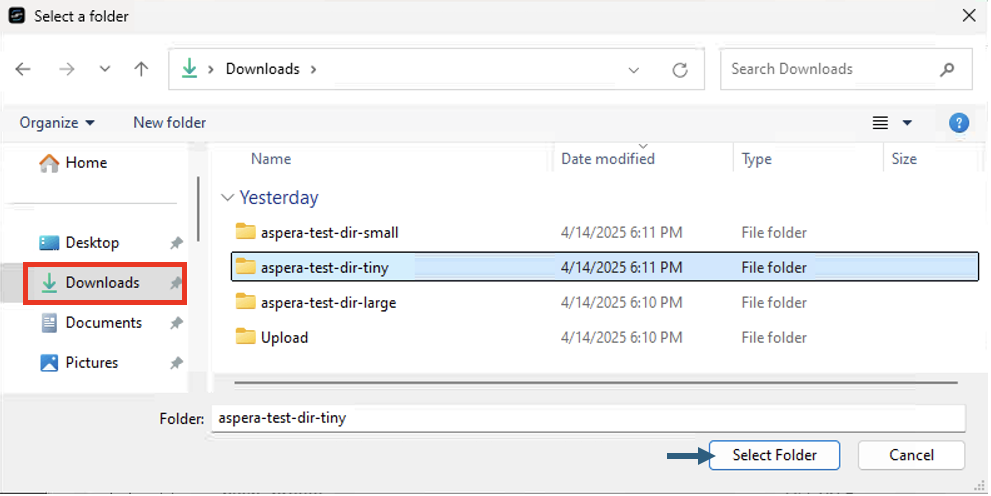
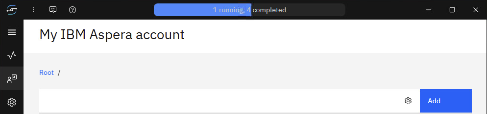
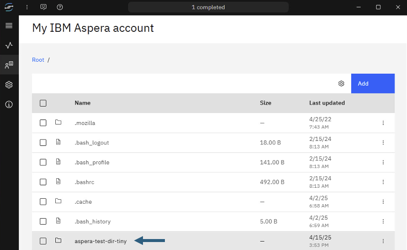
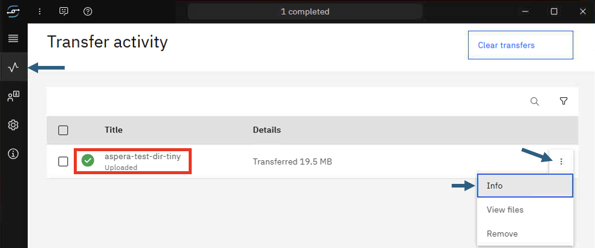
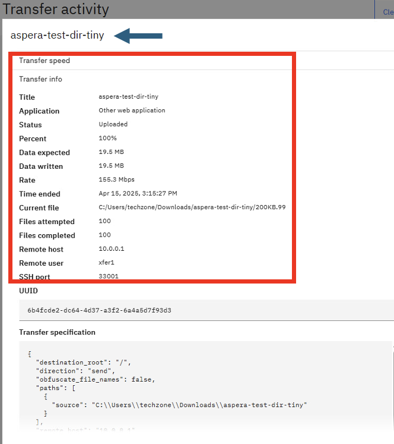
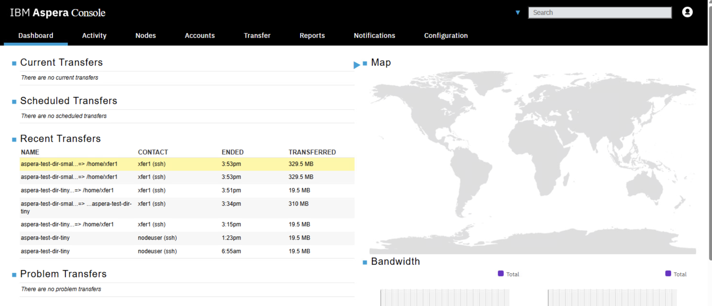

# IBM Aspera for desktop - Transfer files to HSTS Local Storage


[Return to Aspera for desktop labs page](../index.md)

---

# Table of Contents 
- [1. Overview](#overview)
- [2. Shutdown IBM Aspera Connect](#shutdown)
- [3. Aspera for desktop](#desktop)
- [4. Transfer Activity](#activity)
- [5. Aspera Console ](#console)
- [6. Summary](#summary)

---

## 1. Overview <a name="overiew"></a>

This is a very simple lab to transfer files from the IBM Aspera for desktop (new client) to the HSTS local storage folder /home/xfer1. In the VDI, IBM Aspera Desktop is already configured to connect to the HSTS server on aspera1 server (10.0.0.1).<br>

Note: IBM Aspera for desktop is a ** NEW ** Aspera Product released in the 1st Quarter 2025. This doesn't require IBM Aspera Connect. <br>




## 2. Shutdown IBM Aspera Connect <a name="shutdown"></a>

Open Windows Command Prompt and terminate \"IBM Aspera Connect\". <br>



Run the below command to shutdown \"IBM Aspera Connect\". <br>
```
taskkill /f /t /im asperaconnect.exe
```


## 3. Aspera for desktop  <a name="desktop"></a>

Open IBM Aspera for desktop from the Windows Desktop as below. <br>


Optional: Explore Account Settings by clicking on the 3 dots next to the "My Aspera account", and click "Edit" option. <br>



Double click on "My IBM Aspera account" tile. It will be connected to the HSTS server, and will show files under /home/xfer1 folder.<br>


Click on \<Add\> Button, then click on \<Upload folder\> option. <br>



Click on the Downloads folder on the left, then select aspera-test-dir-tiny folder, and then click \<Select folder\> button. <br>


The File Upload should be initiated and you can watch the upload status as below. <br>


The folder should be uploaded by now as below. <br>



## 4. Transfer Activity <a name="activity"></a>
Now switch to "Transfer Activity" by clicking the "Transfer Monitor" Button on the left (as below). <br>



That should show detailed transfer status. <br>



## 5. Aspera Console (Optional) <a name="aspera-console"></a>
You can also check the Transfer Activity from Aspera Console User Interface. <br>

Open "IBM Aspera Console" from the Google Chrome Bookmark bar. Login with the credentials provided. You should see the transfer activity being recorded as below. Explore the activity.<br>





## 6. Summary <a name="summary"></a>
You have explored the ** NEW ** IBM Aspera Desktop to transfer files from the local computer to Aspera High Speed Transfer's Local Storage. <br>


#### !!! Congratulations !!!

[Return to Aspera for desktop labs page](../index.md)


