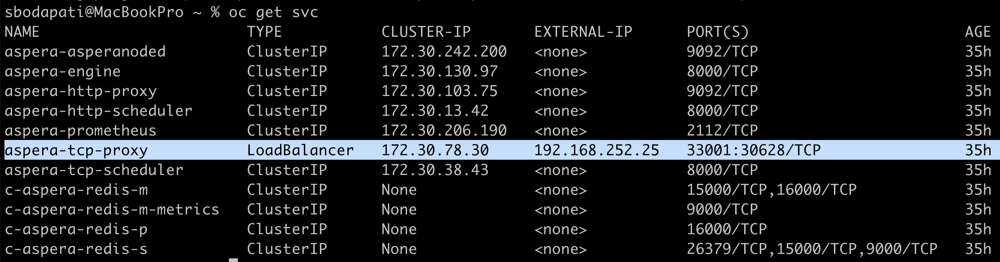

# Aspera CP4I setup

Follow these steps to install Aspera in IBM Techzone OpenShift Cluster. <br>
<br>

## 1. Aspera Catalog source 

Add Aspera catalog source to the OpenShift cluster. <br>

oc apply --filename https://raw.githubusercontent.com/IBM/cloud-pak/master/repo/case/ibm-aspera-hsts-operator/1.5.13/OLM/catalog-sources.yaml


## 2. Aspera Subscription

Subscribe Aspera operator into openshift-operators namespace.

```
apiVersion: operators.coreos.com/v1alpha1
kind: Subscription
metadata:
  labels:
    operators.coreos.com/aspera-hsts-operator.openshift-operators: ""
  name: aspera-hsts-operator
  namespace: openshift-operators
spec:
  channel: v1.5
  installPlanApproval: Automatic
  name: aspera-hsts-operator
  source: aspera-operators
  sourceNamespace: openshift-marketplace
```


## 3. Aspera Instance

Capture the Aspera CP4I evaluation key and paste below. Below specificiation is a Production type of configuration. <br>

```
apiVersion: hsts.aspera.ibm.com/v1
kind: IbmAsperaHsts
metadata:
  name: aspera
  labels:
    app.kubernetes.io/instance: ibm-aspera-hsts-prod
    app.kubernetes.io/managed-by: ibm-aspera-hsts
    app.kubernetes.io/name: ibm-aspera-hsts-prod
  namespace: cp4i-aspera
spec:
  license:
    accept: true
    key: 'PASTE THE KEY HERE'
    use: CloudPakForIntegrationProduction
  containers:
    ascp:
      resources:
        limits:
          cpu: 4000m
          memory: 4096Mi
        requests:
          cpu: 500m
          memory: 512Mi
    asperanoded:
      resources:
        limits:
          cpu: 2000m
          memory: 1024Mi
        requests:
          cpu: 500m
          memory: 512Mi
    default:
      resources:
        limits:
          cpu: 500m
          memory: 512Mi
        requests:
          cpu: 250m
          memory: 256Mi
  storages:
    - claimName: hsts-transfer-pvc
      class: ocs-storagecluster-cephfs
      deleteClaim: true
      mountPath: /data/
      size: 2000Gi
  redis:
    resources:
      requests:
        cpu: 1000m
        memory: 8Gi
    persistence:
      enabled: true
  services:
    httpProxy:
      type: ClusterIP
    tcpProxy:
      type: LoadBalancer
  version: 4.0.0
```


## 4. Check LoadBalancer service

Run oc get svc. The LoadBalancer service will be in Pending state. <br>

```
sbodapati@MacBookPro mqdv03 % oc get svc
NAME                       TYPE           CLUSTER-IP       EXTERNAL-IP   PORT(S)                        AGE
aspera-asperanoded         ClusterIP      172.30.242.200   <none>        9092/TCP                       25h
aspera-engine              ClusterIP      172.30.130.97    <none>        8000/TCP                       25h
aspera-http-proxy          ClusterIP      172.30.103.75    <none>        9092/TCP                       25h
aspera-http-scheduler      ClusterIP      172.30.13.42     <none>        8000/TCP                       25h
aspera-prometheus          ClusterIP      172.30.206.190   <none>        2112/TCP                       25h
aspera-tcp-proxy           LoadBalancer   172.30.78.30     <pending>     33001:30628/TCP                25h
aspera-tcp-scheduler       ClusterIP      172.30.38.43     <none>        8000/TCP                       25h
```

Need to configure MetalLB as below to fix the LoadBalancer Pending state. <br>
<br>


## 4. MetalLB Operator

Create MetalLB operator & Subscription. <br><br>


### 4.1 MetalLB Instance

Subscribe MetalLB operator into openshift-operators namespace.<br>


```
apiVersion: operators.coreos.com/v1alpha1
kind: Subscription
metadata:
  labels:
    operators.coreos.com/metallb-operator.metallb-system: ""
  name: metallb-operator
  namespace: metallb-system
spec:
  channel: stable
  installPlanApproval: Automatic
  name: metallb-operator
  source: redhat-operators
  sourceNamespace: openshift-marketplace
```
<br>


### 4.2 MetalLB Instance

Creaet MetalLB instance as below.<br>

```
 apiVersion: metallb.io/v1beta1
 kind: MetalLB
 metadata:
   name: metallb
 namespace: metallb-system
```


### 4.3 MetalLB IPAddressPool

Find IP address of the nodes.<br>

```
$ oc get nodes -o wide | awk '{print$1,$6}'

NAME INTERNAL-IP
master-1  192.168.252.11
master-2  192.168.252.12
master-3  192.168.252.13
storage-1 192.168.252.19
storage-2 192.168.252.20
storage-3 192.168.252.21
worker-1  192.168.252.14
worker-2  192.168.252.15
worker-3  192.168.252.16
worker-4  192.168.252.17
worker-5  192.168.252.18
```

Use IP address range that is not used as below. For example, in above upto 21 is used, so pick an address from 22 or higher. <br>


Create IPAddressPool kind. <br>

```
apiVersion: metallb.io/v1beta1
kind: IPAddressPool
metadata:
  name: first-pool
  namespace: metallb-system
spec:
  addresses:
  - 192.168.252.25-192.168.252.27
  autoAssign: true
  avoidBuggyIPs: false
  serviceAllocation:
    namespaces:
      - cp4i-aspera
```
<br>


### 4.4 MetalLB L2Advertisement

Create L2Advertisement kind. <br>

```
apiVersion: metallb.io/v1beta1
kind: L2Advertisement
metadata:
  name: l2advertisement
  namespace: metallb-system
spec:
  ipAddressPools:
   - first-pool
```

<br>

After the above instances are created, you should see the Aspera LoadBalancer service should be binded to an external TZ IP as below.<br>




You should also notice some of the Aspera pods being recycled.<br>

$ oc get pods -n cp4i-aspera


<br>

You can now access & transfer files using Aspera Desktop Client.
<br>


## 5. References

```
https://github.ibm.com/rajan/Metal-LB/blob/main/openshift.md

https://github.ibm.com/rajan/Metal-LB

```

#### *** end *** ####
