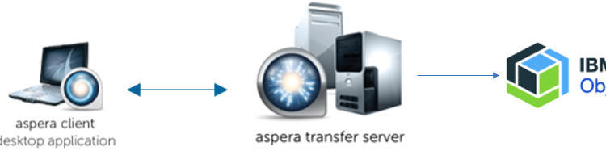
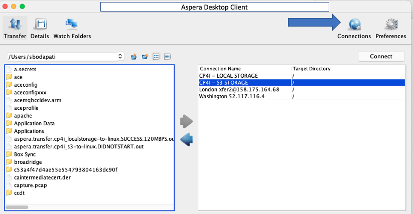
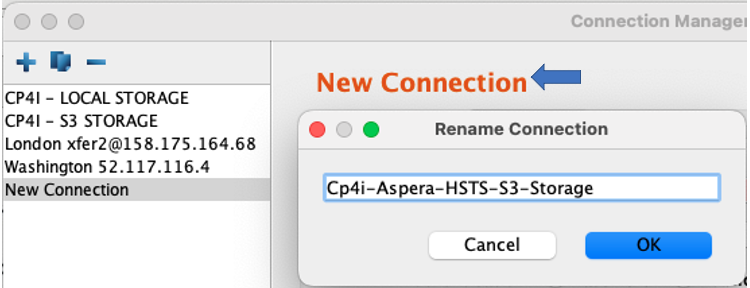
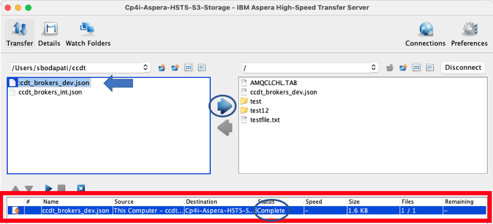
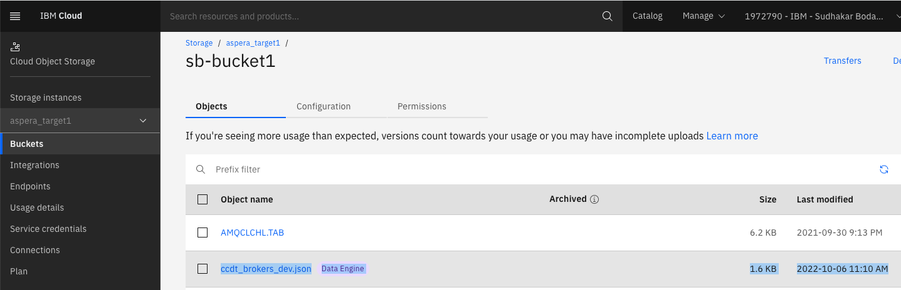

# Aspera Desktop Client - Transfer files to IBM Cloud Object Storage

This lab will guide you how to transfer files to IBM Cloud Object Storage using Aspera Client Applications (1) Aspera Desktop Client (2) Aspera Console.  <br>



<br>

# IBM Team - PreWork
Note: Prework bu IBM team need to be completed to obtain the below credentials. Create a Cloud storage bucket for each student and register the Cloud storage buckets against Aspera CP4I HSTS server. <br>
1) Logon to IBM Cloud <br>
2) Under Resource List > Storage > Create Source > Object Storage <br>
3) Give it a name example Aspera-Cloud-Object-Storage <br>
4) Select Aspera-Cloud-Object-Storage , and create buckets for each student.<br>
5) Capture Service Credentials (access_key_id, secret_access_key) <br>
5) Do the below steps, from your Laptop's command line <br>
```
put the below into a file: aspera-student-1-bucket.json
{
	"storage": {
		"type": "ibm-s3",
		"path": "/",
		"endpoint": "s3.private.us-east.cloud-object-storage.appdomain.cloud",
		"bucket": "sb-bucket1",
		"credentials": {
			"access_key_id": "xxxx",
			"secret_access_key": "xxxxx"
		}
	}
}
```

Note: <br>
“endpoint_” retrieve from here (private).
https://cloud.ibm.com/docs/cloud-object-storage?topic=cloud-object-storage-endpoints#endpoints-region <br>
“access_key_id”, “secret_access_key” are the “service credentials” of the Object storage. <br>

$ curl -ik -u "<cp4i-hsts-instance-name>:<aspera-noded-password" https://hsts-http-proxy-cp4i-aspera.ocp-dev1-290268003089a11bfac4ffe6a9d666b7-0000.us-east.containers.appdomain.cloud/access_keys -X POST -d @aspera-student-1-bucket.json

repeat the above for each student and save the credentials. these credentials will later be used by each student!

<br>


# Aspera Desktop Client 

Logon to the VDI Desktop! <br>

Open Aspera Desktop Client Application. <br>



### Configure Connection
Click on "Connection Manager" icon <br>
This will open Connection Manager. You will be able to create a connection to Aspera High Speed Transfer Server's attached IBM Cloud storage Object Storage.<br>

Click on the plus (+) sign on the top left of the window to create a "New Connection". <br>

Rename "New Connection" <br>

Click on "New Connection" and rename "New Connection" to "Cp4i-Aspera-HSTS-S3-Storage". Click <OK> <br>

Fill in the values <br>

Host: https://hsts-http-proxy-cp4i-aspera.ocp-dev1-290268003089a11bfac4ffe6a9d666b7-0000.us-east.containers.appdomain.cloud <br>
User: X_Mbn_c-xxxxx-gv87E_P <br>
Authentication: Select Password option <br>
Password: xxx-xxxx <br>
Hit "Test Connection" to validate the connection. <br>

Make sure it's tested successfully! Click <OK> <br>
<br>


### Connect to Aspera HSTS instance
Select "Cp4i-Aspera-HSTS-S3-Storage" and click "Connect". <br>

### Transfer files into your S3 Object Storage & Bucket


### Validate files in S3 Object Storage 
Logon to IBM Cloud, and the S3 storage. Open student1-bucket. <br>
Make sure the file(s) you transferred are there. <br>



!!! Congratulations - You have finished Aspera Desktop lab !!! <br> 


