# Aspera Command LIne - ascli

[Return to Aspera Command Line labs page](../index.md)

---

# Table of Contents 
- [1. Overview](#overview)
- [2. Using ascli with Node](#ascli-node)
- [3. Using ascli with Aspera Shares](#ascli-shares)
- [4. Using ascli with Aspera Faspex5](#ascli-faspex5)
- [5. Summary](#summary)

---


## 1. Overview <a name="overiew"></a>

This lab will go over how ot use ascli command line tool. ascli is a command line tool to interfact with Aspera HSTS, Aspera FaspEx, Aspera Shares, Aspera on Cloud, and more. You can use ascli to upload/download files.<br>

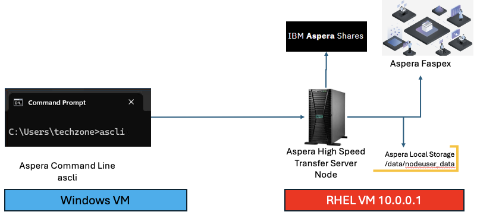

Reference: https://github.com/IBM/aspera-cli
<br>

**Note:** Run the below commands from the Windows VM > Command Prompt. <br>

```
ascli --version
```

## 2. Using ascli with Node <a name="ascli-node"></a>

**Upload** a file <br>

```
ascli -N node --url=https://10.0.0.1:9092 --username=asperanodeuser --password=WelcometoAspera@2025 up ‘C:\Users\techzone\Downloads\aspera-test-dir-tiny\200KB.18’  --insecure=yes
```
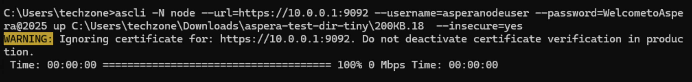

**Aspera Console** to see the transfers.<br>
From the Chrome bookmark bar, open Aspera Console and login with the admin credentials.<br>
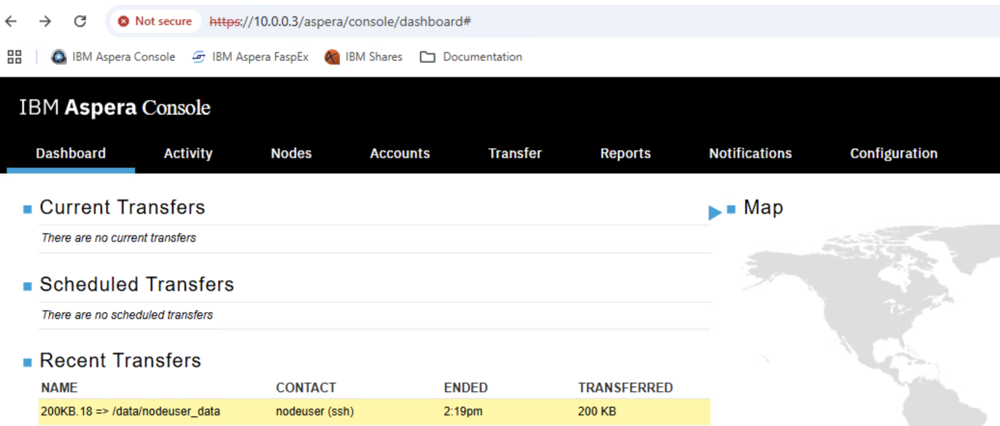


## 3. Using ascli with Aspera Shares <a name="ascli-shares"></a>

**Browsing** Shared Folders.<br>
```
ascli shares repo browse / --url=https://10.0.0.1 --username=admin --password=WelcometoAspera@2025 --insecure=yes
```
Output should looks like this.
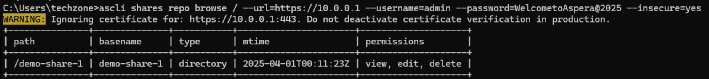

**Upload** to Shared Folder demo-share-1<br>
```
ascli shares repository upload --to-folder="demo-share-1/" C:\Users\techzone\Downloads\aspera-test-dir-small\10MB.1 --url=https://10.0.0.1/ --username=admin --password=WelcometoAspera@2025 --insecure=yes
```
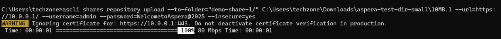

**Browse** demo-share-1/ <br>
```
ascli shares repo browse demo-share-1/ --url=https://10.0.0.1 --username=admin --password=WelcometoAspera@2025 --insecure=yes
```
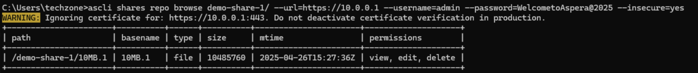


**Aspera Console** to see the transfers.<br>
From the Chrome bookmark bar, open Aspera Console and login with the admin credentials.<br>
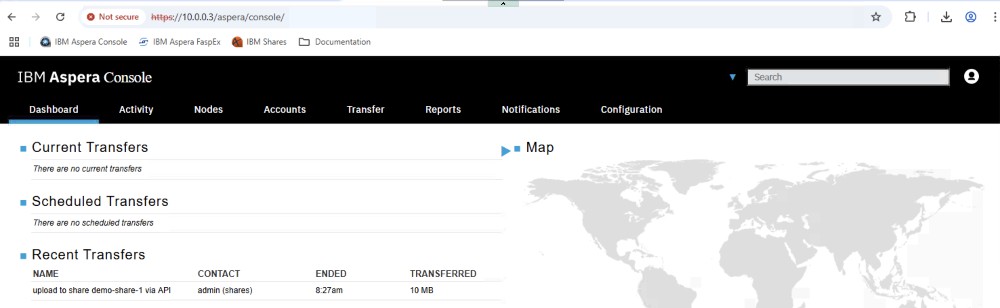

You should see the transfer status as above. Click on the transfer to see additional details about the transfer. <br>

<br>


## 4. Using ascli with Aspera Faspex5 <a name="ascli-faspex5"></a>


```
Replace your-personal-email with your email id.

ascli faspex5 package send @json:'{"title":"faspex5 test1", "recipients":["your-personal-email"]}' C:\Users\techzone\Downloads\aspera-test-dir-tiny\200KB.1
```

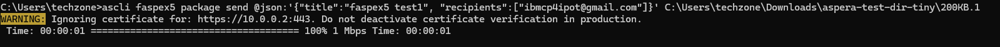

```
ascli faspex5 package list
```
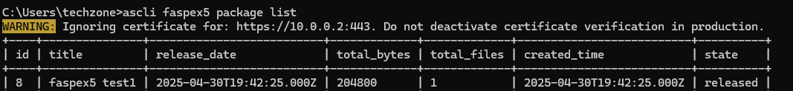


## Receive the package
```
ascli faspex5 package receive 8
```

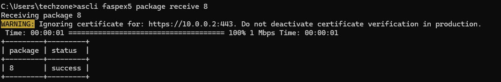


```
C:\users\techzone\dir PKG*
```
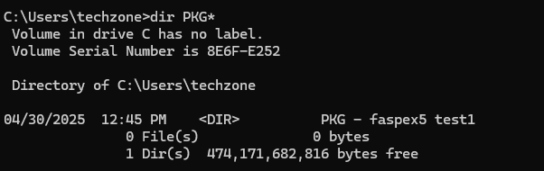


```
C:\users\techzone\dir "PKG - faspex5 test1"
```
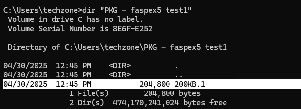


<br>


## 5. Summary <a name="summary"></a>

You have explored ascli command line tool to transfer files & packages with Aspera. <br>

<br>

### !!! End of lab !!!

<br>
<br>

[Return to Aspera Command Line labs page](../index.md)


## 6. *** NOTES *** 

#### Presetting faspex5
From the Faspex5 console, generate ClientID, and Secret. <br>
Admin App > Configurations > API clients > Create New <br>
Name: ascli. <br>
Enable JWT grant type: On <br>

ClientID, Secret will be generated, you will need them next. <br>
<br> 
Windows Command Prompt: <br>
ascli conf wiz https://10.0.0.2 faspex5 --show-secrets=yes --username=ibmcp4ipot@gmail.com --client-id=xxx --client-secret=xxxx --insecure-yes
<br>
The above will generate a private key and public key. <br>
Copy the Public Key, <br>
```
cd C:\Users\techzone\.aspera\ascli
cd C:\Users\techzone\.aspera\ascli> type my_private_key.pem.pub
Copy the full certificate.
```
Paste the Public key. <br>
Open Faspex5 Console. Navigate to your profile (top right of the screen), scroll down to "Public key in PEM format", and paste the Public key. <br>


