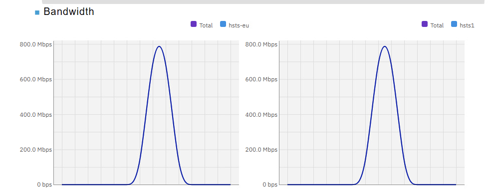
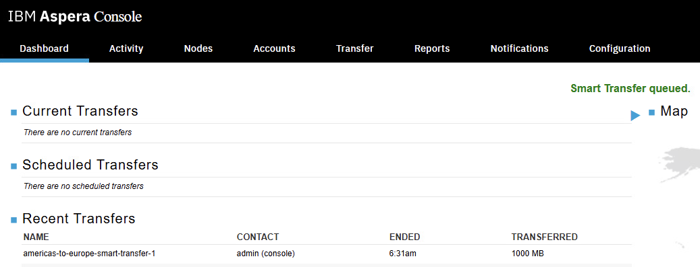

# Smart Transfers - Using Aspera Console to Transfer files between AMERICAS and EUROPE Regions

[Return to Aspera Console labs page](../index.md)


---

# Table of Contents 
- [1. Overview](#overview)
- [2. Environment](#environment)
  * [2.1 EUROPE Environment Setup](#environment-europe)
  * [2.2 AMERICAS Environment Setup](#environment-americas)
- [3. Create Smart Transfer from AMERICAS to EUROPE](#create-smart-transfer)
- [4. SFTP Transfer from AMERICAS to EUROPE](#sftp-transfer)
- [5. Summary](#summary)

---


## 1. Overview <a name="overiew"></a>


In this lab, you will employ IBM Aspera Console to configure Smart Transfer aimed at transferring files from the AMERICAS Region to the EUROPE Region. Furthermore, examine the transfer speeds by contrasting Aspera FASP with SFTP/TCP through the transfer of a 10GB file between these two regions.

Component Diagram: <br>


<br>


## 2. Environment <a name="environment"></a>

You will utilize two IBM Techzone environments, one reserved in the USA Region and the other in EUROPE Region.

After reserving the two environments, we need to configure them. 

First, we will configure the EUROPE environment, and then AMERICAS environment. <br><br>


### 2.1 EUROPE Environment Setup <a name="environment-europe"></a>

Open Techzone EUROPE lab environment. <br>


Scroll down to the bottom. <br>

Capture "Router WAN IP" of EUROPE Techzone Environment.<br>


***** ***** 

Open Windows VM's Console. <br>


Use CAD (Control Alt Delete) button, and login to the Windows VM. <br>
Credentials: techzone / IBMDem0s
<br><br>

Open Putty program. <br>

Open Putty Program from the Windows Desktop or Taskbar in the bottom of the screen. <br>


Login as ibmuser / engageibm. <br>

Run setup_target_env.sh. This will copy a HSTS (High Speed Transfer Server) license to EUROPE HSTS, then it updates aspera.conf with the EUROPE Router WAN IP. Additionally, it will also restart aspera services. <br>
```
sudo ./setup-target-env.sh "PASTE-YOUR-EUROPE-Router-WAN-IP"
```
<br>


### 2.2 AMERICAS Environment Setup <a name="environment-americas"></a>

Logon to the Windows Virtual Machine as techzone / IBMDem0s user. <br>

Open Chrome Browser, and click on "Aspera Console" from the Bookmark bar. <br>

Login as admin/WelcometoAspera@2025. <br>

Add Destination Aspera HSTS (High Speed Transfer Server) Node, under Nodes tab. <br>


Enter EUROPE region's "Router WAN IP", Name, and select "Default endpoint type" as "Node API" as below. 
<br>


Click **\<Create\>**.

<br>
Enter Node API Credentials asperanodeuser/WelcometoAspera@2025, then click \<Update\>.


<br>

Click on **\<Test Credentials\>** button.


<br>


You should see "Successfully connected to node via Node API.
<br>

Now, click on Map tab, and check "Show on map". Also, drag the location circle to Europe as below and click on \<Save Changes\> button.<br>


Click on \<List Managed Nodes\> button. Now you should see High Speed Transfer Server Node for AMERICAS, and Aspera High Speed Transfer Server Node for EUROPE listed as below.
<br>


<br>


## 3. Create Smart Transfer from AMERICAS to EUROPE <a name="create-smart-transfer"></a>

Click on Transfer Tab as below. <br>


Select Source, and the preconfigured hsts1 Node as below. <br>


Now, click on "Choose Source Directory" button, and select AMERICAS folder. The AMERICAS folder has just one file which is a 10GB file. <br>


Now, select "Always transfer the entire directory" under "Items to transfer" dropdown box. <br>


Now, click on the Destination box, and select "hsts-eu" under the Connect section. <br>


Enter Login user, password as asperanodeuser/WelcometoAspera@2025.
<br>


Choose destination Directory, and select "FROM.AMERICAS" then click \<OK\>. <br>


Open Transfer section, and make sure the "Target rate" is set to 1GB network. <br>


Now, click on **\<Save\>** button. <br>


Your newly created Smart Transfer should appear as below. <br>


Start the Transfer as below. <br>


Click the \<Start\> Button. <br>


You should see 


Notice the Status being changed from Queued > Submitted > Running. <br>


Watch the transfer speed in the bottom of the page. <br>



Click on the Transfer. <br>



You should see the transfer details. <br>


** NOTE: ** It only took 1 minute and 23seconds to transfer 10GB file. <br>


## 4. SFTP Transfer from AMERICAS to EUROPE <a name="sftp-transfer"></a>

Let's rub an SFTP Transfer over TCP to compare the transfer speeds between TCP vs. FASP. <br>

Open Putty Program from the Windows VM's Desktop or Taskbar in the bottom of the screen. <br>


Login as ibmuser / engageibm. <br>

Run the below commands (see the screenshot). We will initiate SFTP transfer from AMERICAS to EUROPE, and lets use the <Router WAN IP> of EUROPE. <br>


```
cd /data/nodeuser_data/AMERICAS
sftp ibmuser@<Router WAN IP>
put 10GB-Marketing-data.1
```


Notice that it took 8 minutes and 24 seconds to transfer the 10GB file from AMERICAS to EUROPE. <br>

<br>


## 5. Summary <a name="summary"></a>
You have investigated the SFTP and FASP protocols for transferring files across two distant regions and observed the transfer speeds. As observed, utilizing FASP technology results in approximately 90% faster data transfer speeds.
<br> 

**NOTE:** Explore Aspera Console and it's features by clicking on the other tabs. <br> 

<br>
#### Congratulations ###