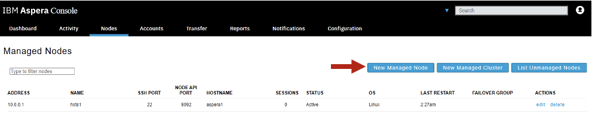
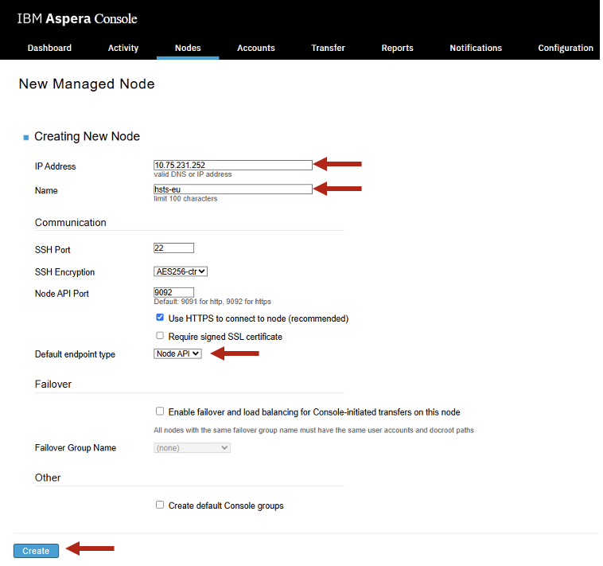

# Watch Folders - Using Aspera Console to Transfer files between AMERICAS and EUROPE Regions

[Return to Aspera Console labs page](../index.md)


---

# Table of Contents 
- [1. Overview](#overview)
- [2. Environment](#environment)
  * [2.1 EUROPE Environment Setup](#environment-europe)
  * [2.2 AMERICAS Environment Setup](#environment-americas)
- [3. Create Watch Folders from AMERICAS to EUROPE](#create-watch-folders)
- [4. Summary](#summary)

---


## 1. Overview <a name="overiew"></a>

In this laboratory, you will employ IBM Aspera Console to configure Watch Folders aimed at the automatic transfer of files from the AMERICAS Region to the EUROPE Region. The Watch Folders functionality of Aspera will oversee a source directory at predetermined intervals, facilitating the transfer of files to the designated destination.
<br>

Component Diagram: <br>


<br>


## 2. Environment <a name="environment"></a>

<br>
**** NOTE **** <br>
SKIP THIS SECTION, IF YOU HAVE COMPLETED THE PREVIOUS "Smart Transfers" lab. <br>
**** NOTE **** <br>

<br>
You will utilize two IBM Techzone environments, one established in the USA Region and the other in the EUROPE Region.
<br>

Let's first configure EUROPE environment, then configure AMERICAS. <br>


### 2.1 EUROPE Environment Setup <a name="environment-europe"></a>


Capture "Router WAN IP" of EUROPE Techzone Environment.<br>


Logon to aspera1 virtual machine as ibmuser / engageibm. Use Putty program from the Windows Desktop.<br>

Run setup_target_env.sh. This will copy a HSTS license to EUROPE HSTS, then it updates aspera.conf with the Router WAN IP. Additionally, it will also restart aspera services. <br>
```
sudo ./setup-target-env.sh <Router WAN IP>
```
<br>


### 2.2 AMERICAS Environment Setup <a name="environment-americas"></a>

Logon to the Windows Virtual Machine as techzone / IBMDem0s user. <br>

Open Chrome Browser, and click on "Aspera Console" from the Bookmark bar. <br>

Add Destination Aspera HSTS (High Speed Transfer Server) Node, under Nodes tab. <br>



Enter EUROPE region's "Router WAN IP", Name, and select "Default endpoint type" as "Node API" as below. 
<br>



Click **\<Create\>**.

<br>
Enter Node API Credentials asperanodeuser/WelcometoAspera@2025, then click \<Update\>.


<br>

Click on **\<Test Credentials\>** button.


<br>


You should see "Successfully connected to node via Node API.
<br>

Now, click on Map tab, and check "Show on map". Also, drag the location circle to Europe as below and click on \<Save Changes\> button.<br>


Click on \<List Managed Nodes\> button. Now you should see High Speed Transfer Server Node for AMERICAS, and Aspera High Speed Transfer Server Node for EUROPE listed as below.
<br>


<br>


## 3. Create Watch Folders from AMERICAS to EUROPE <a name="create-watch-folders"></a>

Click on the "Activity" Tab > Watch Folders > Create New WatchFolder button as below. <br>


Enter watch-folder-americas-europe-1, and click on the Source Node dropdown and select hsts1 as below.<br>


Now, click "Browse" button, <br>


Select AMERICAS folder. The AMERICAS folder has just one file which is a 10GB file. <br>


Now, enter the Router WAN IP of EUROPE environment as below. <br>


Now, enter Login user, Target Authentication, Password as below, then click on Browse to select the destination directory. <br>

Enter Login user, password as asperanodeuser/WelcometoAspera@2025.


Choose destination Directory, and select "FROM.AMERICAS" then click \<OK\>. <br>


Now, hit \<Create\> button. <br>


Your newly created Watch Folder should appear as below. <br>


Now, click on the Dashboard tab, and you should see the 10GB file being transfered from AMERICAS to EUROPE. <BR>


Scroll down and check Bandwidth utilization. <br>


Check "Recent Transfers", and click on the Watch Folder process. <br>


Check the transfer Speeds. <br>


## 4. Summary <a name="summary"></a>
You have explored Watch Folders functionality ofg IBM Aspera tbrough IBM Aspera Console. You are able to create a Watch Folder to transfer files automatically upon arrival of a file into AMERICAS folder to another region (EUROPE).
<br> 

**NOTE:** Explore Aspera Console and it's features by clicking on the other tabs. <br> 

<br>
#### Congratulations ###