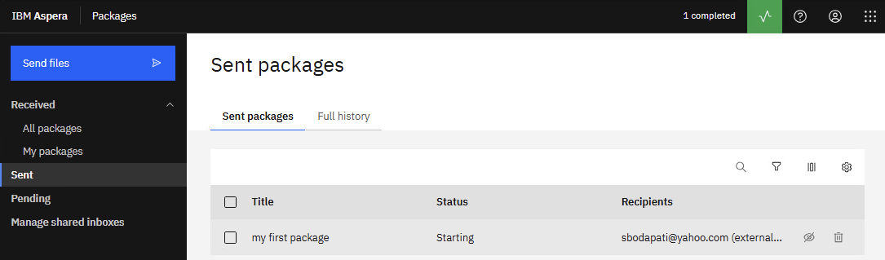
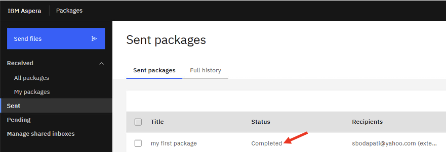

# Aspera Faspex - Person to Person file/package sharing

[Return to Aspera Faspex labs page](../index.md)

---

# Table of Contents 
- [1. Overview](#overview)
- [2. Logon to Aspera Faspex](#login)
- [3. Send Files](#send)
- [4. Check for email](#email)
- [5. Summary](#summary)

---

## 1. Overview 

In this lab, you will use IBM Aspera Faspex to package and share files via Email.

**Component Diagram**  

 

## 2. Logon to Aspera Faspex 

From the Windows VDI, open Google Chrome brower, and click on \"Aspera Faspex\" bookmark from the Bookmark Bar.  

Login with your admin id.  
user: ibmcp4ipot@gmail.com  
password: WelcometoAspera@2025 

## 3. Send Files 

**Launch Aspera for Desktop**  
if you see "IBM Aspera for Desktop" in the bottom of the page, click on it.  

Select "Launch now" option.  

Now you should see "Add Files" button right below the Title.  

**Personal Email**  
For the lab purpose, send the package to your personal email.  

When you type your email, it will show up under Contacts field. Select the email, and it will be added into the To Field.  

Hit \<Send\>. 

Notice the status change to \"Starting\".  

Notice the status change.  

Click on Transfer Monitor on the top right of the screen for additional details.  

Notice the status changed to Completed.

## 4. Check for email 

Open your WebMail from the browser (for example yahoo mail).  

Check your Email Inbox, see if you received Email from "Faspex Techzone".  

**Note:** Check your Spam folder just incase.  

Now, click the \"Download Package\".  

That should open a page to download the files that you were shared.  

Select the file(s) to download.  

## 5. Summary 

You explored how IBM Aspera Faspex can be used to upload and share files between people via Email.  

   
#### Congratulations ###

[Return to Aspera Faspex labs page](../index.md)
