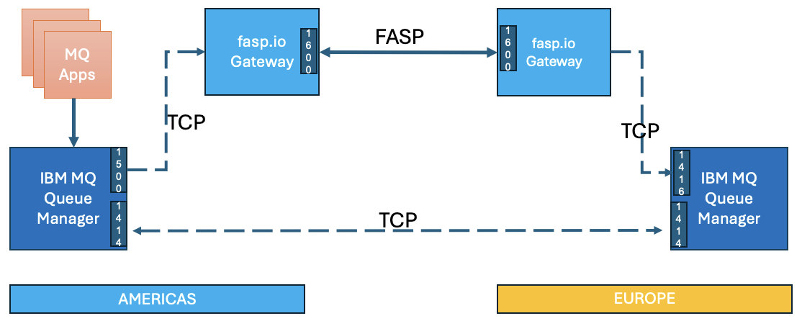
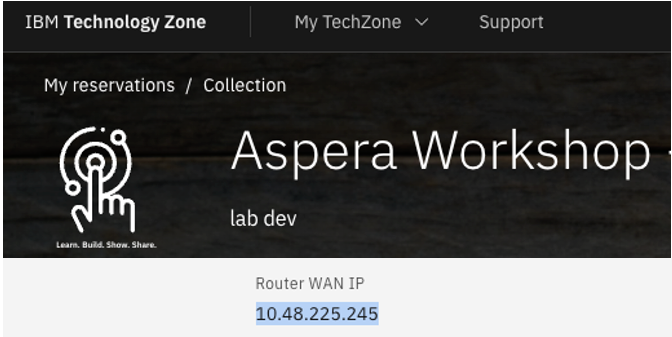
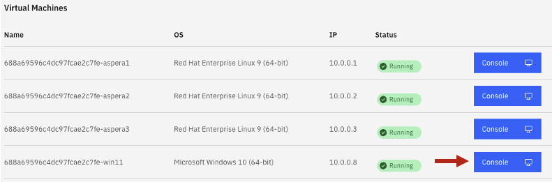
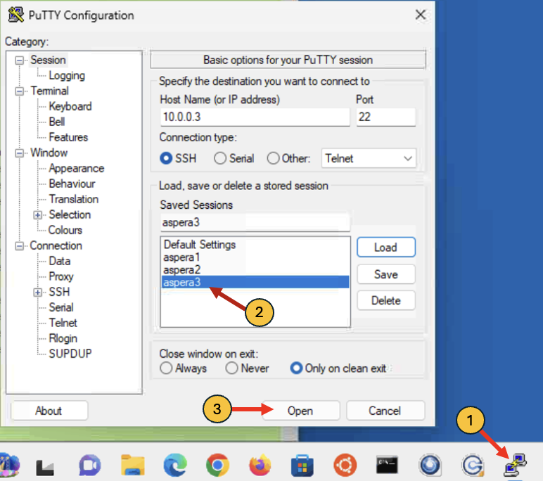
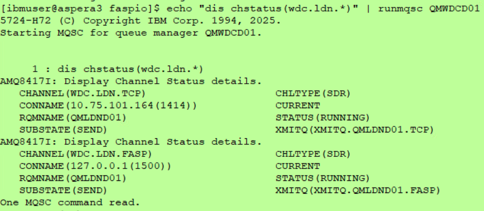
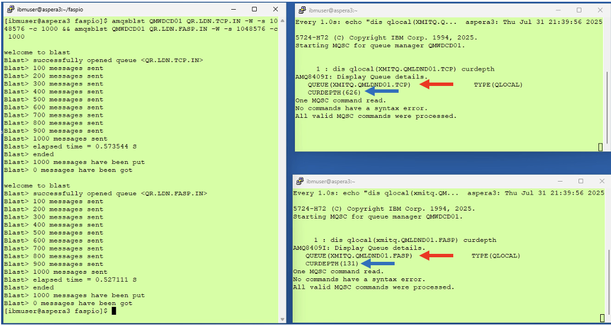
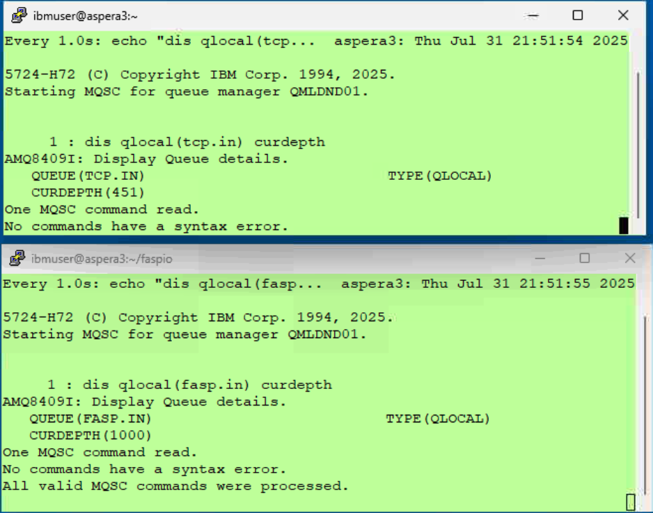
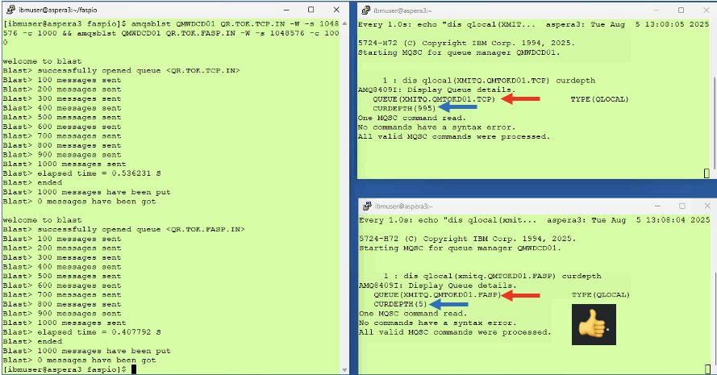

# Aspera faspio gateway with IBM MQ

[Return to Aspera faspio labs page](../index.md)


---

# Table of Contents 
- [1. Overview](#overview)
- [2. Prepare the lab environment ](#lab-env-prep)
- [3. faspio gateway setup ](#faspio-setup)
  * [3.1 AMERICAS Environment Setup](#faspio-setup-americas)
  * [3.2 EUROPE Environment Setup](#faspio-setup-europe)
- [4. MQ Queue Manager Setup](#mq-setup)
- [5. MQ Channels Verify](#mq-channel-verify)
  * [5.2 AMERICAS Environment Setup](#mq-channel-verify-americas)
- [6. Testing TCP vs FASP](#testing)
  * [6.1 AMERICAS Environment](#testing-americas)
  * [6.2 EUROPE Environment](#testing-europe)
- [7. Summary](#summary)

---

## 1. Overview <a name="overiew"></a>

In this laboratory, you will explore the benefits of employing the IBM Aspera faspio Gateway alongside IBM MQ Queue Managers that are situated in two remote regions. 

**What is Aspera faspio Gateway?** <br>
IBM Aspera faspio Gateway is a software component that accelerates TCP-based data transfers between systems, leveraging the Aspera FASP protocol for high-speed, reliable, and secure data movement over any distance. It acts as a bridge, enhancing data transfer performance, particularly over networks with high latency or packet loss. 
<br>


Architecture Diagram<br>


The IBM MQ Queue Managers between AMERICAS, and EUROPE are linked via a set of Sender/Receiver TCP channels.
<br>
Then, we will leverage IBM Aspera faspio bridge between the MQ Sender/Receiver Channels to speed up message transfer between the two Queue Managers. <br>

**Environment** <br>
You will make use of two IBM Techzone environments situated in the AMERICAS and EUROPE regions. <br>

**Testing** <br>
You will be testing two usecases.<br>
a) Send 1000 messages of 1MB size over TCP Channel<br>
b) Send 1000 messages of 1MB size over FASP Channel <br>

Then, compare the results TCP vs FASP. <br>
<br>


## 2. Prepare the lab environment <a name="lab-env-prep"></a>

Capture IP address of AMERICAS and EUROPE environments.<br>



Save the IP Address(s) to a Notepad. You will need these to setup faspio gateway on both the regions. <br>

<br>


## 3. faspio Gateway Setup <a name="faspio-setup"></a>

In this step, you will setup Aspera faspio Gateway on both the regions. <br>


### 3.1 AMERICAS Environment Setup <a name="faspio-setup-americas"></a>

From the Google Chrome browser, open AMERICAS environment URL. <br>

Open Windows Virtual Machine. <br>


Open 3 Putty Program, then open **aspera3** Virtual Machine. <br>



Arrange the 3-Putty Windows side by side. <br>

**Login Credentials:** ibmuser/engageibm
<br>

On the 1st Putty Window, run the following commands. <br>

```
cd ~/faspio
sudo ./setup-faspio.sh <EUROPE-SERVER-IP-ADDRESS>
```

This step will create aspera-license, and gateway.toml files into /etc/faspio-gateway directory. <br> 

**Note:** Aspera faspio Gateway license is required. Aspera faspio Gateway is part of IBM MQ Advanced entitlement. <br>

<br>


MODIFY gateway.toml file. <br>
Lets fix the misconfiguration in gateway.toml. Lets replace the inbound port from 1500 to 1416. <br>
Run the below commands.
<br>

```
sudo cp /etc/faspio-gateway/gateway.toml /etc/faspio-gateway/gateway.toml.old

sed ':1; /1500/! { n; b1 }; :2; n; s/1500/1416/; b2' /etc/faspio-gateway/gateway.toml > /tmp/gateway.toml

sudo mv /tmp/gateway.toml /etc/faspio-gateway/gateway.toml
```

<br>

**Setup faspio Gateway** <br>
```
sudo systemctl enable faspio-gateway
sudo systemctl start faspio-gateway
sudo systemctl status faspio-gateway
```

**Note:** Please make sure there aren't any errors and faspio is started successfully.

<br>


### 3.2 EUROPE Environment Setup <a name="faspio-setup-europe"></a>

From a new tab in the Google Chrome browser, open EUROPE environment URL. <br>

Open 3 Putty Program, then open **aspera3** Virtual Machine. <br>


Arrange the 3-Putty Windows side by side. <br>

**Login Credentials:** ibmuser/engageibm
<br>

One the first Putty Window, run the following commands. <br>

```
cd ~/faspio
sudo ./setup-faspio.sh <AMERICAS-SERVER-IP-ADDRESS>
```

This step will create aspera-license, and gateway.toml files into /etc/faspio-gateway directory. <br> 


MODIFY gateway.toml file. <br>
Lets fix the misconfiguration in gateway.toml. Lets replace the inbound port from 1500 to 1416. <br>
Run the below commands.
<br>

```
sudo cp /etc/faspio-gateway/gateway.toml /etc/faspio-gateway/gateway.toml.old

sed ':1; /1500/! { n; b1 }; :2; n; s/1500/1416/; b2' /etc/faspio-gateway/gateway.toml > /tmp/gateway.toml

sudo mv /tmp/gateway.toml /etc/faspio-gateway/gateway.toml
```


<br>
**Setup faspio Gateway** <br>

```
sudo systemctl enable faspio-gateway
sudo systemctl start faspio-gateway
sudo systemctl status faspio-gateway
```

**Note:** Please make sure there aren't any errors and faspio is started successfully.


## 4. MQ Queue Manager Setup <a name="mq-setup"></a>

In this step, you will setup IBM MQ Queue Mansgers on both the regions. <br>

### 4.1 AMERICAS Environment Setup <a name="mq-setup-americas"></a>

You are tasked with establishing a Queue Manager named QMWDCD01 (where WDC denotes Washington DC). <br>

```
cd ~/faspio
./setup-americas-europe-qmgr.sh <EUROPE-SERVER-IP-ADDRESS>
```
Review the results. <br>

**Note:** Due to the time limitations of the workshop, we streamlined the lab process and developed scripts for establishing the MQ Queue Managers and their connectivity. Kindly review the scripts if time allows. <br> 


### 4.2 EUROPE Environment <a name="mq-setup-americas"></a>

You are tasked with establishing a Queue Manager named QMLDND01 (where LDN denotes London). <br>

```
cd ~/faspio
./setup-europe-americas-qmgr.sh <AMERICAS-SERVER-IP-ADDRESS>
```
Review the results. <br>

<br>


## 5. MQ Channels Verify <a name="mq-channel-verify"></a>

Now, lets verify the MQ Channels are in RUNNING state. <br>


### 5.1 AMERICAS Environment <a name="mq-channel-verify-americas"></a>

```
echo "dis chstatus(wdc.ldn.*)" | runmqsc QMWDCD01
```



<br>


## 6. Testing TCP vs FASP <a name="testing"></a>

It is now the moment to evaluate our efforts. <br>


### 6.1 AMERICAS Environment <a name="testing-americas"></a>

Copy and paste the below commands in each of the Putty Windows. <br>

**Putty Window3** <br>
```
watch -n 1 'echo "dis qlocal(xmitq.QMLDND01.FASP) curdepth" | runmqsc QMWDCD01'
```

**Putty Window2** <br>
```
watch -n 1 'echo "dis qlocal(XMITQ.QMLDND01.TCP) curdepth" | runmqsc QMWDCD01'
```

**Putty Window1** <br>
Lets blast 1000 messages of each message size of 1MB into the TCP and FASP Remote Queues. <br>
```
amqsblst QMWDCD01 QR.LDN.TCP.IN -W -s 1048576 -c 1000 && amqsblst QMWDCD01 QR.LDN.FASP.IN -W -s 1048576 -c 1000
```

<br>

The MQ blast messages program dumps 1000 messages into both TCP and FASP transmission Queues at almost the same time.
<br>

********************************************************** <br>
**OBSERVE the Speed TCP vs FASP**<br>
********************************************************** <br>



Notice that FASP Transmission Queue is being drained quicker than TCP Transmission Queue.
<br>

### 6.2 EUROPE Environment (Optional) <a name="upload"></a>

Copy and paste the below commands in each of the Putty Windows. <br>

**Putty Window3** <br>
```
watch -n 1 'echo "dis qlocal(fasp.in) curdepth" | runmqsc QMLDND01'
```

**Putty Window2** <br>
```
watch -n 1 'echo "dis qlocal(tcp.in) curdepth" | runmqsc QMLDND01'
```

if, the transfer is successful you should see 1000 messages in TCP.IN, and FASP.IN queues. <br>



Note that the TCP transfer is still going in the top window in the screenshot above. <br>

<br>


## 7. Summary <a name="summary"></a>

You explored the functionalities of the IBM Aspera faspio Gateway by connecting IBM MQ Channels, which led to an improvement in transfer speeds of 60-70%. Furthermore, you have the ability to modify the Channel BATCHSZ attribute to enhance performance even more.
<br>

The distance significantly impairs TCP performance, and this is where FASP excels. Below is an illustration of the same tests conducted between the AMERICAS and ASIAPACIFIC Regions.



As observed, the FASP transmission queue is nearly depleted, whereas the TCP transmission queue is exceedingly sluggish. It is evident that there is a significant disparity in the transfer rates between TCP and FASP across remote areas and slow networks.

<br>

### !!! End of lab !!!

<br>

[Return to Aspera faspio labs page](../index.md)
