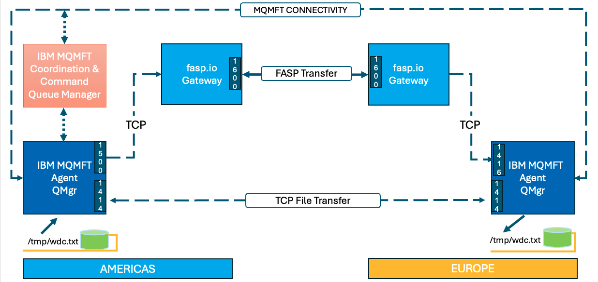
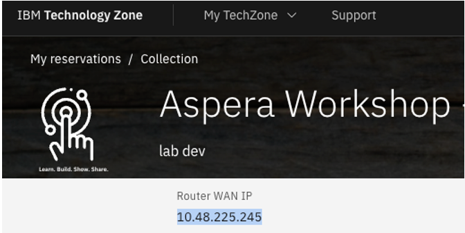
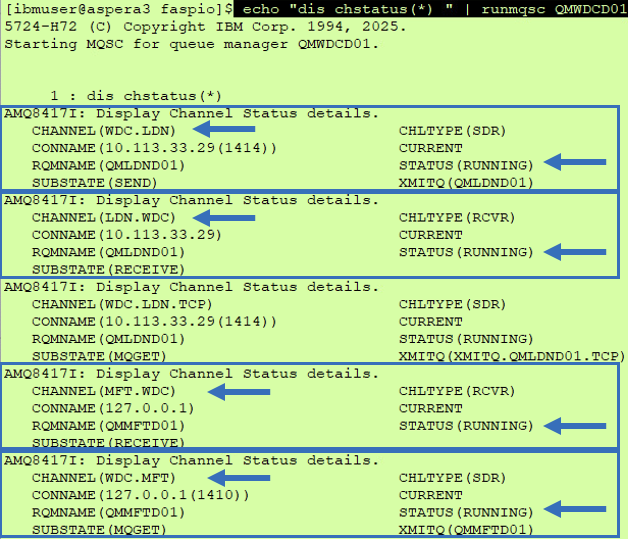
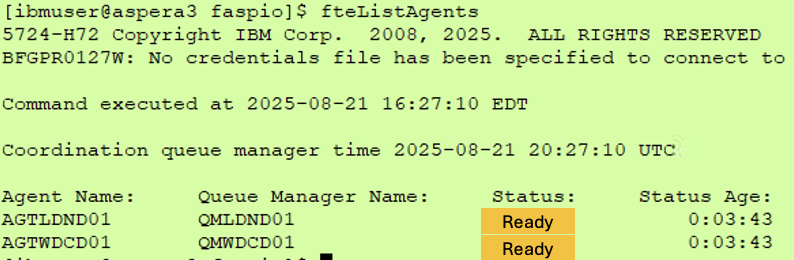
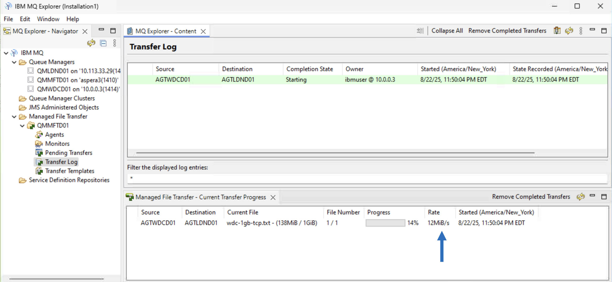

# Aspera faspio gateway with IBM MQ Managed File Transfer (MQMFT)

[Return to Aspera faspio labs page](../index.md)


---

# Table of Contents 
- [1. Overview](#overview)
- [2. Prepare the lab environment ](#lab-env-prep)
- [3. faspio gateway setup ](#faspio-setup)
  * [3.1 AMERICAS Environment Setup](#faspio-setup-americas)
  * [3.2 EUROPE Environment Setup](#faspio-setup-europe)
- [4. MQ Queue Manager Setup](#mq-setup)
- [5. MQ Channels Verify](#mq-channel-verify)
  * [5.2 AMERICAS Environment Setup](#mq-channel-verify-americas)
- [6. Testing TCP vs FASP](#testing)
  * [6.1 AMERICAS Environment](#testing-americas)
  * [6.2 EUROPE Environment](#testing-europe)
- [7. Summary](#summary)

---

## 1. Overview <a name="overiew"></a>

In this laboratory, you will explore the benefits of employing the IBM Aspera faspio Gateway alongside IBM MQ Managed File Transfer Queue Managers and its Agents that are situated in two remote regions. 

**What is Aspera faspio Gateway?** <br>
IBM Aspera faspio Gateway is a software component that accelerates TCP-based data transfers between systems, leveraging the Aspera FASP protocol for high-speed, reliable, and secure data movement over any distance. It acts as a bridge, enhancing data transfer performance, particularly over networks with high latency or packet loss. 
<br>


Architecture Diagram<br>



The IBM MQMFT Agent Queue Managers between AMERICAS, and EUROPE are linked via a set of Sender/Receiver TCP channels.
<br>
Then, we will leverage IBM Aspera faspio bridge between the MQ Sender/Receiver Channels to speed up file transfers between the two Queue Managers. <br>

**Environment** <br>
You will make use of two IBM Techzone environments situated in the AMERICAS and EUROPE regions. <br>

**Testing** <br>
You will be testing two usecases.<br>
a) Send 1GB file over TCP Channel<br>
b) Send 1GB file over FASP Channel <br>

Then, compare the results TCP vs FASP. <br>
<br>


## 2. Prepare the lab environment <a name="lab-env-prep"></a>

Capture IP address of AMERICAS and EUROPE environments.<br>



Save the IP Address(s) to a Notepad. You will need these to setup faspio gateway on both the regions. <br>

<br>


## 2. MQ Managed File Transfer Queue Manager Setup <a name="mq-setup"></a>

In this step, you will setup IBM MQ Queue Mansgers for Managed File Transfer Queue Manager for Coordination & Command, Agent Queue Manager in AMERICAS, and Agent Queue Manager in EUROPE. <br>

### 2.1 AMERICAS Environment Setup <a name="mq-setup-americas"></a>

You are tasked with establishing a Queue Manager named QMMFTD01. QMMFTD01 will be used as a MQ Manaaged File Transfer Coordination Queue Manager. QMWDCD01 (where WDC denotes Washington DC), which you have created in the previous lab will be used as Managed File Transfer Agent Queue Manager. <br>

```
cd ~/faspio
./setup-americas-europe-qmgr-mqmft.sh <EUROPE-SERVER-IP-ADDRESS>
```
Review the results. <br>

The script will create QMMFTD01, and an Managed File Transfer Agent called AGTWDCD01. <br>

**Note:** Due to the time limitations of the workshop, we streamlined the lab process and developed scripts for establishing the MQ Queue Managers and their connectivity. Kindly review the scripts if time allows. <br> 


### 2.2 EUROPE Environment <a name="mq-setup-americas"></a>

QMLDND01 (where LDN denotes London), which you have created in the previous lab will be used as Managed File Transfer Agent Queue Manager. 


```
cd ~/faspio
./setup-europe-americas-qmgr-mqmft.sh <AMERICAS-SERVER-IP-ADDRESS>
```
Review the results. <br>

<br>


## 3. MQ Channels Verify <a name="mq-channel-verify"></a>

Now, lets verify the MQ Channels are in RUNNING state. <br>


### 3.1 AMERICAS Environment <a name="mq-channel-verify-americas"></a>

```
echo "dis chstatus(wdc.ldn.*)" | runmqsc QMWDCD01
```



<br>


## 4. Testing TCP File Transfer <a name="testing"></a>

It is now the moment to evaluate our efforts. <br>


This is use case 1, see architecture diagram under section 2.1.
<br>
Run the following commands from Washington VM, and London VM.<br>
### 4.1 Transfer Zero bytes file 
<table>
    <thead>
      <tr>
        <th>WDC</th>
        <th>LDN</th>
      </tr>
    </thead>
    <tbody>
        <tr>
            <td> touch /tmp/test1.txt

fteCreateTransfer -rt -1 -jn "test-wdc-ldn-1" -sa AGTWDC01 -sm QMWDCD01 -da AGTLDN01 -dm QMLDND01 -sd delete -dd "/tmp/" "/tmp/test1.txt" -de overwrite
</td>
            <td>ls -l /tmp 

Make sure test1.txt is transferred.</td>
        </tr>
    </tbody>
  </table>

### 4.2 Transfer 1GB file

Run the following commands from Washington VM, and London VM.<br>

<table>
    <thead>
      <tr>
        <th>WDC</th>
        <th>LDN</th>
      </tr>
    </thead>
    <tbody>
        <tr>
            <td>dd if=/dev/zero of=/tmp/wdc.txt bs=1024 count=1048576

fteCreateTransfer -rt -1 -jn "test-wdc-ldn-1" -sa AGTWDC01 -sm QMWDCD01 -da AGTLDN01 -dm QMLDND01 -sd delete -dd "/tmp/" "/tmp/wdc.txt " -de overwrite
</td>
            <td>ls -l /tmp

Make sure test1.txt is transferred.</td>
        </tr>
    </tbody>
  </table>

<br>


### 4.3 MQExplorer - Verify Transfer Status 

Open MQExplorer on AMERICAS Windows VM. <br>

Add all three Queue Managers.<br>

<b>Add QMMFTD01 Managed File Transfer Configuration as below.</b><br>

For the Coordination Queue Manager > Choose QMMFTD01.<br>
For the Command Queue Manager > Choose QMMFTD01.<br>
For the Configuration Name, choose default value QMMFTD01.<br>
<br>
<b>Connect to QMMFTD01 Managed File Transfer Configuration as below.</b><br>


#### Click on Transfer Log 


## 5. fasp.io - configuration 

This is use case 2, see architecture diagram under section 2.2.
<br>
Configure Channels to route traffic to the fasp.io Gateway.<br>

<table>
    <thead>
      <tr>
        <th>WDC</th>
        <th>LDN</th>
      </tr>
    </thead>
    <tbody>
        <tr>
            <td>STOP CHL(WDC.LDN)

DIS CHSTATUS(WDC.LDN)

alter chl(WDC.LDN) CHLTYPE(SDR) CONNAME('xx.xx.xx.xx(1500)')

START CHL(WDC.LDN)
</td>
            <td>STOP CHL(LDN.WDC)

DIS CHSTATUS(LDN.WDC)

alter chl(ldn.wdc) CHLTYPE(SDR) CONNAME('yy.yy.yy.yy(1500)')

START CHL(LDN.WDC)
</td>
        </tr>
    </tbody>
  </table>


<br>

## 6. Testing FASP Transfers


### 6.1 Transfer Zero bytes file 
<table>
    <thead>
      <tr>
        <th>WDC</th>
        <th>LDN</th>
      </tr>
    </thead>
    <tbody>
        <tr>
            <td> touch /tmp/test1.txt

fteCreateTransfer -rt -1 -jn "test-wdc-ldn-1" -sa AGTWDC01 -sm QMWDCD01 -da AGTLDN01 -dm QMLDND01 -sd delete -dd "/tmp/" "/tmp/test1.txt" -de overwrite
</td>
            <td>ls -l /tmp 

Make sure test1.txt is transferred.</td>
        </tr>
    </tbody>
  </table>

### 6.2 Transfer 1GB file

<table>
    <thead>
      <tr>
        <th>WDC</th>
        <th>LDN</th>
      </tr>
    </thead>
    <tbody>
        <tr>
            <td>dd if=/dev/zero of=wdc.txt bs=1024 count=1048576

fteCreateTransfer -rt -1 -jn "test-wdc-ldn-1" -sa AGTWDC01 -sm QMWDCD01 -da AGTLDN01 -dm QMLDND01 -sd delete -dd "/tmp/" "/tmp/wdc.txt " -de overwrite
</td>
            <td>ls -l /tmp

Make sure test1.txt is transferred.</td>
        </tr>
    </tbody>
  </table>


### 6.3 MQExplorer - Verify Transfer Status 

Open MQExplorer on Washington VM, and verify Transfer log. <br>


Now compare the difference between TCP Transfer, and FASP.IO gateway transfer of 1GB file. You should see 60-65% transfer rate increase.


<br><br>

## Congratulations!!!
## You have successfully completed the MQ File Transfers using fasp.io MQ Advanced module !!!


### 4.1 AMERICAS Environment <a name="testing-americas"></a>

Copy and paste the below commands in each of the Putty Windows. <br>

**Putty Window3** <br>
```
watch -n 1 'echo "dis qlocal(xmitq.QMLDND01.FASP) curdepth" | runmqsc QMWDCD01'
```

**Putty Window2** <br>
```
watch -n 1 'echo "dis qlocal(XMITQ.QMLDND01.TCP) curdepth" | runmqsc QMWDCD01'
```

**Putty Window1** <br>
Lets blast 1000 messages of each message size of 1MB into the TCP and FASP Remote Queues. <br>
```
amqsblst QMWDCD01 QR.LDN.TCP.IN -W -s 1048576 -c 1000 && amqsblst QMWDCD01 QR.LDN.FASP.IN -W -s 1048576 -c 1000
```

<br>

The MQ blast messages program dumps 1000 messages into both TCP and FASP transmission Queues at almost the same time.
<br>

********************************************************** <br>
**OBSERVE the Speed TCP vs FASP**<br>
********************************************************** <br>



Notice that FASP Transmission Queue is being drained quicker than TCP Transmission Queue.
<br>

### 6.2 EUROPE Environment (Optional) <a name="upload"></a>

Copy and paste the below commands in each of the Putty Windows. <br>

**Putty Window3** <br>
```
watch -n 1 'echo "dis qlocal(fasp.in) curdepth" | runmqsc QMLDND01'
```

**Putty Window2** <br>
```
watch -n 1 'echo "dis qlocal(tcp.in) curdepth" | runmqsc QMLDND01'
```

if, the transfer is successful you should see 1000 messages in TCP.IN, and FASP.IN queues. <br>


Note that the TCP transfer is still going in the top window in the screenshot above. <br>

<br>


## 7. Summary <a name="summary"></a>

You explored the functionalities of the IBM Aspera faspio Gateway by connecting IBM MQ Channels, which led to an improvement in transfer speeds of 60-70%. Furthermore, you have the ability to modify the Channel BATCHSZ attribute to enhance performance even more.
<br>

The distance significantly impairs TCP performance, and this is where FASP excels. Below is an illustration of the same tests conducted between the AMERICAS and ASIAPACIFIC Regions.



As observed, the FASP transmission queue is nearly depleted, whereas the TCP transmission queue is exceedingly sluggish. It is evident that there is a significant disparity in the transfer rates between TCP and FASP across remote areas and slow networks.

<br>

### !!! End of lab !!!

<br>

[Return to Aspera faspio labs page](../index.md)
