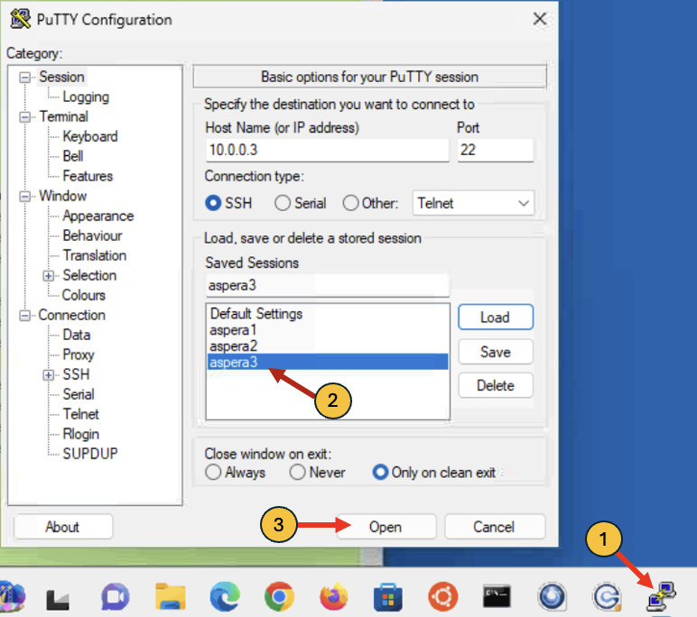

# Aspera faspio gateway with IBM MQ Managed File Transfer (MQMFT)

[Return to Aspera faspio labs page](../index.md)


---

# Table of Contents 
- [1. Overview](#overview)
- [2. Prepare the lab environment ](#lab-env-prep)
- [3. MQ Managed File Transfer Setup](#mq-setup)
  * [3.1 AMERICAS Environment Setup](#mq-setup-americas)
  * [3.2 EUROPE Environment Setup](#mq-setup-europe)
- [4. MQ Channels Verify](#mq-channel-verify)
  * [4.1 AMERICAS Environment - MQ Channels Verify](#mq-channel-verify-americas)
  * [4.2 AMERICAS Environment - MQ Managed File Transfer Agents Verify](#mqmft-agents-verify-americas)
- [5. Testing TCP File Transfer](#tcp-testing)
  * [5.1 AMERICAS Environment - MQ Explorer ](#mq-explorer)
  * [5.2 AMERICAS Environment - Transfer 1GB file ](#tcp-testing-1gb-byte-file)
- [6. Switch MQ Channels to FASP](#faspio-setup)
  * [6.1 AMERICAS Environment - Switch MQ Channels to to FASP](#mq-channel-fasp-switch-americas)
- [7. Testing FASP Transfers](#fasp-testing-americas)
  * [7.1 Transfer 1GB file](#fasp-testing-1gb-byte-file)
- [8. Summary](#summary)

---

## 1. Overview <a name="overiew"></a>

In this laboratory, you will explore the benefits of employing the IBM Aspera faspio Gateway alongside IBM MQ Managed File Transfer Queue Managers and its Agents that are situated in two remote regions. 

**What is Aspera faspio Gateway?** <br>
IBM Aspera faspio Gateway is a software component that accelerates TCP-based data transfers between systems, leveraging the Aspera FASP protocol for high-speed, reliable, and secure data movement over any distance. It acts as a bridge, enhancing data transfer performance, particularly over networks with high latency or packet loss. 
<br>

Architecture Diagram<br>


The IBM MQ Managed File Transfer Coordination, Command and Managed File Transfer Agent(s) Queue Managers between AMERICAS, and EUROPE are linked via a set of Sender/Receiver TCP channels.
<br>
Then, we will leverage IBM Aspera faspio bridge between the IBM MQ Sender/Receiver Channels to speed up file transfers between the two Queue Managers. <br>

**Environment** <br>
You will make use of two IBM Techzone environments situated in the AMERICAS and EUROPE regions. <br>

**Testing** <br>
You will be testing two usecases.<br>
a) Send 1GB file over TCP Channel<br>
b) Send 1GB file over FASP Channel <br>

Then, compare the results TCP vs FASP. <br>
<br>

**Note:**<br>
**faspio lab1 is a pre-requirement. lab1 will takes care of faspio gateway setup, creation of the Agent Queue Managers (QMWDCD01, QMLDND01) between the regions.** <br>

<br>


## 2. Prepare the lab environment <a name="lab-env-prep"></a>

Capture IP address of AMERICAS and EUROPE environments.<br>


Save the IP Address(s) to a Notepad. You will need these to setup faspio gateway on both the regions. <br>

<br>


## 3. MQ Managed File Transfer Queue Manager Setup <a name="mq-setup"></a>

In this step, you will setup IBM MQ Queue Mansgers for Managed File Transfer Queue Manager for Coordination & Command, Agent Queue Manager in AMERICAS, and Agent Queue Manager in EUROPE. <br>

### 3.1 AMERICAS Environment Setup <a name="mq-setup-americas"></a>

You are tasked with establishing a Queue Manager named QMMFTD01. QMMFTD01 will be used as a MQ Manaaged File Transfer Coordination Queue Manager. QMWDCD01 (where WDC denotes Washington DC), which you have created in the previous lab will be used as Managed File Transfer Agent Queue Manager. <br>

Open the Windows VM. <br>


Login to the windows VM as techzone / IBMDem0s. <br>

Open Putty Program, and aspera3 virtual machine.



```
cd ~/faspio
./setup-americas-europe-qmgr-mqmft.sh <EUROPE-SERVER-IP-ADDRESS>
```
Review the results. <br>

The script will create QMMFTD01, and an Managed File Transfer Agent called AGTWDCD01. <br>

**Note:** Due to the time limitations of the workshop, we streamlined the lab process and developed scripts for establishing the MQ Queue Managers and their connectivity. Kindly review the scripts if time allows. <br> 


### 3.2 EUROPE Environment <a name="mq-setup-europe"></a>

QMLDND01 (where LDN denotes London), which you have created in the previous lab will be used as Managed File Transfer Agent Queue Manager. 

Open the Windows VM. <br>


Login to the windows VM as techzone / IBMDem0s. <br>

Open Putty Program, and aspera3 virtual machine.


```
cd ~/faspio
./setup-europe-americas-qmgr-mqmft.sh <AMERICAS-SERVER-IP-ADDRESS>
```
Review the results. <br>

<br>


## 4. Verify MQ Channels & Agents  <a name="mq-channel-verify"></a>

Now, lets verify the MQ Channels are in RUNNING state. <br>


### 4.1 AMERICAS Environment - MQ Channel Verify <a name="mq-channel-verify-americas"></a>

Run the below command from aspera3 terminal window. <br>
```
echo "dis chstatus(*)" | runmqsc QMWDCD01
```


### 4.2 AMERICAS Environment - MQ Managed File Transfer Agents Verify <a name="mqmft-agents-verify-americas"></a>

```
fteListAgents
```


<br>


## 5. Testing TCP File Transfer <a name="tcp-testing"></a>

It is now the moment to evaluate our efforts. <br>

### 5.1 AMERICAS Environment - MQ Explorer <a name="mq-explorer"></a>

From the Windows Virtual Machine, open MQ Explorer that can be launched from the Windows Desktop or the taskbar. <br>

Make sure you can connect to all three Queue Managers. if you see below dialog, just select Yes.<br>


You may need to re-add QMLDND01 with correct ROUTER-WAN-IP Address. <br>


<br>
Open Putty program, and launch **"aspera3"** virtual machine. <br>

Logon as ibmuser/engageibm. <br>


### 5.2 AMERICAS Environment - Transfer 1GB file  <a name="tcp-testing-1gb-byte-file"></a>

Run the following commands from **"aspera3"** command line as you did above. <br>


**dd if=/dev/zero of=/tmp/wdc-1gb-tcp.txt bs=1024 count=1048576**

**fteCreateTransfer -rt -1 -jn "test-wdc-ldn-1" -sa AGTWDCD01 -sm QMWDCD01 -da AGTLDND01 -dm QMLDND01 -sd delete -dd "/tmp/" "/tmp/wdc-1gb-tcp.txt " -de overwrite**

Notice the transfer speed is about 12MB/s. <br>


When the transfer is completed, Notice that the elapsed time to transfer 1GB file between AMERICAS and EUROPE is about 1 minute and 17 seconds. <br>


Now, let's transfer a 10GB file. <br>
**dd if=/dev/zero of=/tmp/wdc-10gb-tcp.txt bs=1024 count=10485760**

**fteCreateTransfer -rt -1 -jn "test-wdc-ldn-2" -sa AGTWDCD01 -sm QMWDCD01 -da AGTLDND01 -dm QMLDND01 -sd delete -dd "/tmp/" "/tmp/wdc-10gb-tcp.txt" -de overwrite**


Notice that the transfer speed is about 13-14MB/sec. <br>


Notice that it took 13 minutes and 40 seconds to transfer 10GB file. <br>
<br>

## 6. FASP Switch - Switch MQ Channels to FASP  <a name="faspio-setup"></a>

Now, lets leverage faspio gateway between the MQ Queue Managers. Let's modify the MQ Agent Channels to use FASP Gateway.<br>

### 6.1 AMERICAS Environment - Switch MQ Channels to to FASP  <a name="mq-channel-fasp-switch-americas"></a>

Let's configure MQ Channels to route traffic to the faspio Gateway.<br>

Open Putty program, and launch aspera3 virtual machine. <br>

Logon as ibmuser/engageibm. Run the following commands. <br>

```
cd ~/faspio
./switch-americas-europe-mqchannel-tcp-to-fasp.sh
```


### 6.2 EUROPE Environment - Restart MQ Receiver Channel  <a name="mq-channel-fasp-switch-europe"></a>

Run the below command to restart WDC.LDN channel. <br>

echo "stop channel(wdc.ldn)" | runmqsc QMLDND01
echo "dis chstatus(wdc.ldn)" | runmqsc QMLDND01
Make sure the channel is stopped. <br>
echo "start channel(wdc.ldn)" | runmqsc QMLDND01


## 7. Testing FASP Transfers <a name="fasp-testing-americas"></a>

AMERICAS Environment, open Putty program, and launch aspera3 virtual machine. <br>

Logon as ibmuser/engageibm.<br>

### 7.1 AMERICAS Environment - Transfer 1GB file <a name="fasp-testing-1gb-byte-file"></a>

Run the following commands. <br>

**dd if=/dev/zero of=/tmp/wdc-1gb-fasp.txt bs=1024 count=1048576**

**fteCreateTransfer -rt -1 -jn "test-wdc-ldn-2" -sa AGTWDCD01 -sm QMWDCD01 -da AGTLDND01 -dm QMLDND01 -sd delete -dd "/tmp/" "/tmp/wdc-1gb-fasp.txt " -de overwrite**

Check "Transfer Log" from the MQExplorer. Notice that transfer speed is now at 45MB/s<br>


Check the elapsed time with FASP is now at 33seconds.
<br>


<br>

Now, let's transfer a 10GB file. <br>
**dd if=/dev/zero of=/tmp/wdc-10gb-fasp.txt bs=1024 count=10485760**

**fteCreateTransfer -rt -1 -jn "test-wdc-ldn-3" -sa AGTWDCD01 -sm QMWDCD01 -da AGTLDND01 -dm QMLDND01 -sd delete -dd "/tmp/" "/tmp/wdc-10gb-fasp.txt" -de overwrite**


Notice that the transfer speed is running about 45MB/s. <br>


Notice that the elapsed tiem is about 3 minutes and 44 seconds. <br>


## 8. Summary <a name="summary"></a>
Now compare the difference between TCP Transfer, and FASPIO gateway transfer of 1GB file. You should see 60-65% transfer rate increase.

<br><br><br><br>

### !!! End of lab !!!

<br>

[Return to Aspera faspio labs page](../index.md)
