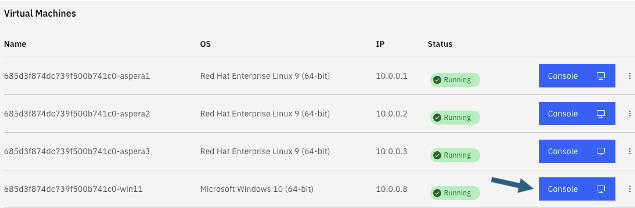

# Aspera Shares - Exploring Shares User Interface

[Return to Aspera Shares labs page](../index.md)

---

# Table of Contents 
- [1. Overview](#overview)
- [2. Logon to Aspera Shares ](#login)
- [3. Uploading file to demo-share-1](#upload)
- [3. Downloading file from demo-share-1](#download)
- [5. Summary](#summary)

---

## 1. Overview 

This lab will explore how to navigate around Aspera Shares GUI. You can explore how to Upload files to share with other members of the organization. You can also observe the transfer speeds that Aspera offers using FASP technology.  

Component Diagram  

## 2. Logon to Aspera Shares 

Click on the Windows VDI, and login as techzone/IBMDem0s.  

Open Chrome Browser, and click on "Aspera Shares" from the Bookmark bar.

Login with admin / WelcometoAspera@2025 credentials.  

The system is pre-configured with an HSTS Node (aspera1), and a Shared folder (demo-share-1).  

## 3. Uploading file to demo-share-1 

Click on "demo-share-1" Shared folder.  

You may be asked to open IBM Aspera client. Check the checkbox, and click on \<Open IBM Aspera\> button.  

Click on "Upload File" Button.  

Pick 10GB file as above.   

Aspera for desktop is minimized automatically, lets open it. Click on "Aspera for desktop" icon in the taskbar as below.  

Click on "Info" as below.  

Open Transfer speed twisty as below.  

As the transfer is in-progress watch the transfer speed.  

Explore transfer speeds, scroll down and observe transfer specifications.  

Refresh the browser and make sure 10GB file is upload successfully.  

Repeat some more tests and observe the transfer speeds in "Aspera for desktop" window.  

## 4. Downloading file from demo-share-1 

Select the 10GB file that you uploaded before.

## 5. Summary 

You explored IBM Aspera Shares console to Upload & Download files and observed the transfer speeds.  

### !!! End of lab !!!

 
 

[Return to Aspera Shares labs page](../index.md)
